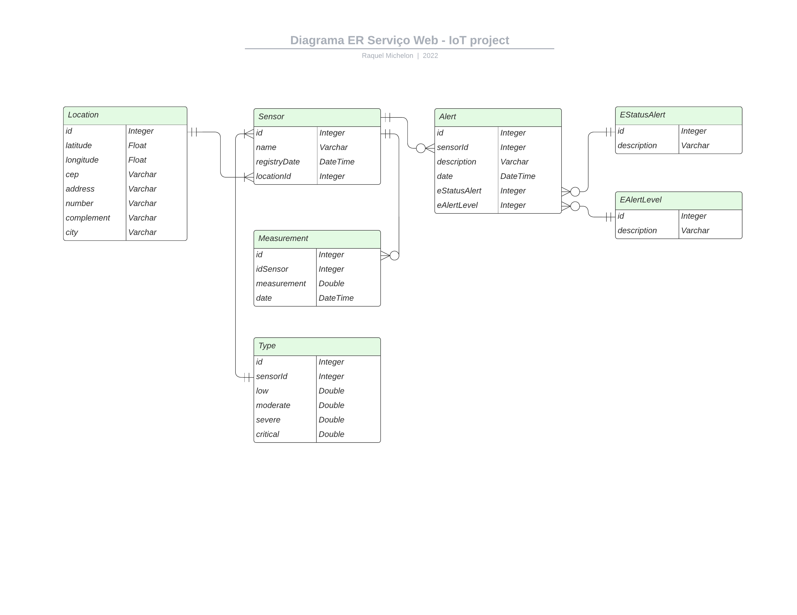
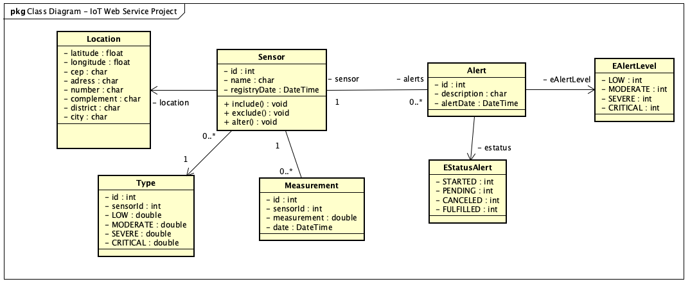

# Raquel's Projects

## Sensors Web Service - Part of an IoT project to mitigate the power cable theft

Web Service to register sensors, sensors measurements and sensors events.

### Entity Relationship Diagram

### Class Diagram

## Sale System - MVC Java Project

- [Project Repository](https://github.com/RaquelMichelon/SalesSystemMVC)
- [Demonstration](https://www.youtube.com/watch?v=aP-1xXkPsm0&t=56s)

## CarWash System - OOP Java Project

- [Project Repository](https://github.com/RaquelMichelon/CarWashSystem---OOP-Project)

## Home. - Web Page to rate rental properties and looking for rental properties rank

- [Project Code](PROJETO-DE-SOFTWARE-II) (code still in refactoring process)
- [Demonstration](https://www.youtube.com/watch?v=ri1dlWPbfgI)

---

⌨️ Created by Raquel Michelon
